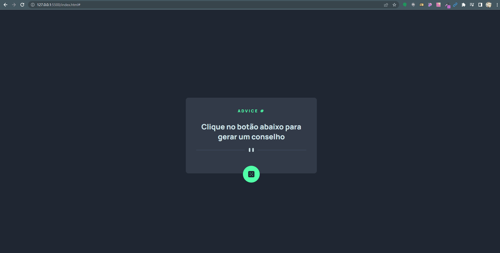

# Card com ADEVICE SLIP JSON API

## Tabela do Conteudo
<ul>
<li><a href="#como-usar">Como usar</li>
<li><a href="#sobre">Sobre</a></li>
<li><a href="#status">Status</a></li>
<li><a href="#objetivo">Objetivo</a></li>
<li><a href="#curiosidade">Curiosidade</a></li>
<li><a href="#tenologias">Tecnologias</a></li>
<li><a href="#acessando-o-site">Acessando o site</a></li>
</ul>

## Como usar

Para utilizar os arquivos do projeto na sua maquina, você deve seguir os passos abaixos:

git clone https://github.com/Lucaszanin/api-gerador-de-conselhos.git

cd api-gerador-de-conselhos 

## Sobre
O projeto foi proposto como desafio avançado de JS no curso Devquest de desenvolvimento front-end, para que sejam aplicados vários coneitos vistos no curso.

## Status

Projeto Card Gerador de Conselhos concluido 🎯

## Objetivo

O principal intuto deste projeto foi aplicar os conseitos de Async functions, fetch, Dom manipulation, functions, events, modules e export. Além de treinar conceitos estruturação de pastas do projeto, CSS e HTML5 semântico e também git e github.

Algumas coisas utilizadas no projeto:

HTML Semântico;
CSS FlexBox;
Responsividade;
Manipulação do DOM;
ArrowFunctions;
Eventos do DOM;
Modulos JS;
Export;
Fetch;

## Curiosidade- Este projeto também é um desafio do site de desafios de Front-End, front-end mentor.

## Tecnologias
<ul>
<li>HTML</li>
<li>CSS</li>
<li>JAVSCRIPT</li>
<li>GIT</li>
</ul>

## Acessando o site

Para acessar o site do projeto Animais Fantásticos, por favor use este link : <a href="https://lucaszanin.github.io/api-gerador-de-conselhos/" target="_blank">API Gerador de Conselhos</a>